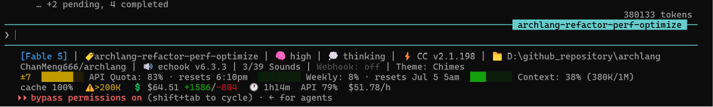
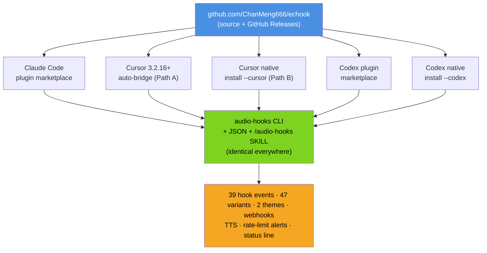
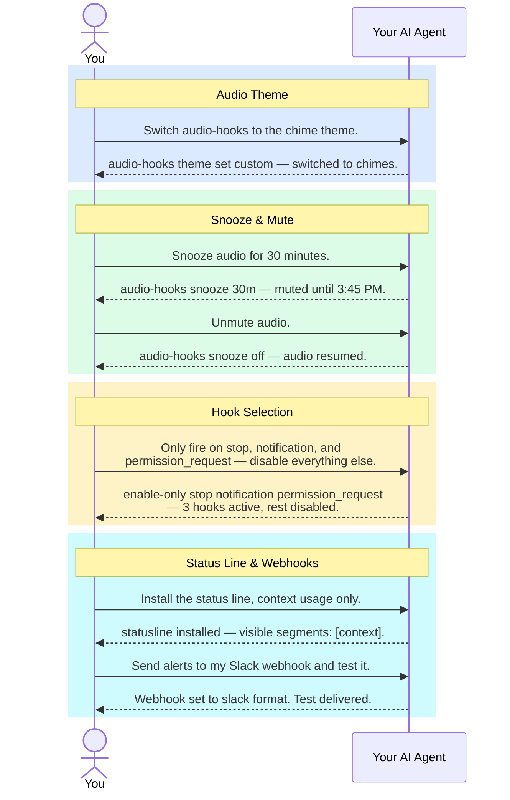
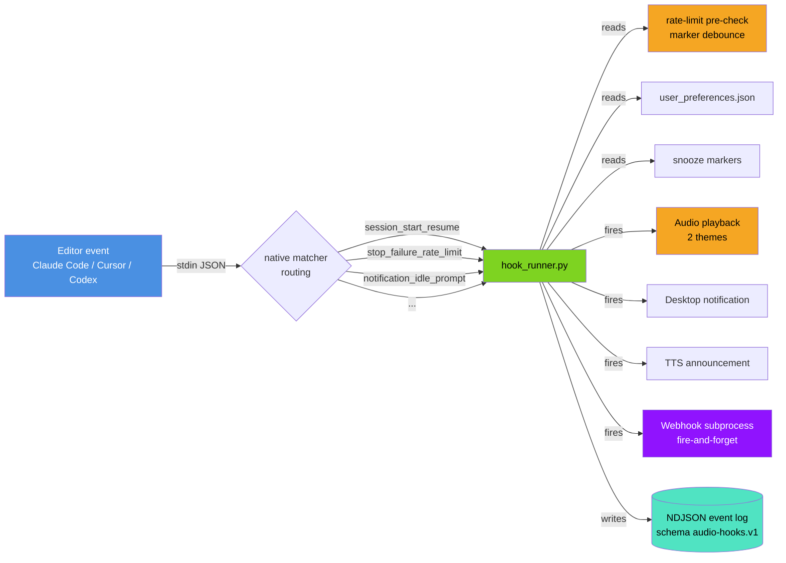

# echook

**Audio and out-of-band notifications for Claude Code, Cursor IDE, and Codex CLI.** 
You configure it by talking to your agent — every setting is one sentence, not a JSON edit. 
Hear when your agent finishes, needs permission, or hits a rate limit — plus an optional context-usage status line.

**v6.7.0** — 39 hook events and 47 matcher variants across all three editors · 2 audio themes · webhooks · TTS · desktop toasts · rate-limit alerts · status line. Renamed `claude-code-audio-hooks` → **echook** (Echo + Hook) in 5.2.1; existing installs keep working. Full history in the [CHANGELOG](./CHANGELOG.md).

**Share This Project**

[![][share-x-shield]][share-x-link]
[![][share-linkedin-shield]][share-linkedin-link]
[![][share-reddit-shield]][share-reddit-link]
[![][share-telegram-shield]][share-telegram-link]
[![][share-whatsapp-shield]][share-whatsapp-link]

---

### Promotional Video

https://github.com/user-attachments/assets/804dff1e-56d8-49b2-b0c0-6706f3eeccd4

Built with Remotion, Claude Code, ElevenLabs & Suno. Source: <a href="https://github.com/ChanMeng666/echook-promo-video">echook-promo-video</a>

> ## 🤖 Install and configure this by asking your agent — there is no hand-edit path
>
> **Humans: don't install or configure echook by hand.** Point your AI agent — **Claude Code, Cursor, or Codex** — at this repo and say:
>
> > *"Install echook from `github.com/ChanMeng666/echook` and set it up for me."*
>
> Your agent reads the docs, runs every command, verifies the result, and reports back. The agent-facing source of truth is [`AGENTS.md`](AGENTS.md) + [`llms.txt`](llms.txt) + the live `audio-hooks manifest`. Every capability is a non-interactive subcommand that takes and returns JSON, and hand-editing `user_preferences.json` is unsupported by design. Two things an agent still can't do for you: type `/reload-plugins` on Claude Code (no CLI equivalent), and restart the editor once on the Cursor and Codex install paths.
>
> **All a human needs to know is what echook _does_** — skim [Key Features](#key-features) below — so you can ask your agent for it in plain English: *"mute audio for an hour"*, *"switch to chimes"*, *"watch my `.env` file"*, *"put a context-usage bar in my status line"*. Not sure what's possible? Just ask your agent **"what can I configure in echook?"**

<kbd>Table of Contents</kbd>

- [What's New](#whats-new)
- [Key Features](#key-features)
- [Get Started](#get-started)
- [Talk to It — Natural Language Control](#talk-to-it--natural-language-control)
- [How It Works](#how-it-works)
- [Platform Support](#platform-support)
- [Help, Uninstall & Documentation](#help-uninstall--documentation)
- [License](#license)
- [Author](#author)

---

## What's New

**Latest: v6.7.0 — three silent failure types now have a sound, the status line reads four more fields Claude Code sends, and looking at the state no longer changes it.** Claude Code sends two `StopFailure` types (`cloud_credential_error`, `verification_required`) and one `Notification` type (`auth_storage_failure`, "login needs attention") that echook had registered no matcher for, so each was a permanent no-op; they are now three more independently switchable variants (47 in all) with their own sounds in both themes. The two error ones follow `stop_failure`: if you enabled the whole parent (`hooks enable stop_failure`) you will now hear two error types that were silent before, while a config that enumerated variants with `hooks enable-only` is migrated so the new ones stay off; `notification_auth_storage_failure` is **off by default** and a login-storage failure stays silent until you run `audio-hooks hooks enable notification_auth_storage_failure`. A filter no longer starts the debounce window: a `stop` skipped by `skip_if_background_tasks_running` used to open it anyway, so the next genuine event could be swallowed although nothing had played. The status line grows from 29 to 33 segments — `spend_limit` (Claude apps gateway) and `fast_mode` render only when Claude Code sends the data, while `prompt_cache` and `remote` are opt-in through the new `statusline_settings.extra_segments`, so upgrading changes no existing status line. Reporting commands — `status`, `diagnose`, `get`, `hooks list`, `manifest`, `logs tail`, `backup list`, every `--help` — now leave your home and data directories untouched (`status` used to create the preferences file and a logs directory in a fresh home); a stale preferences file is migrated by the next hook event, any state-changing command, or the new `audio-hooks migrate`. `audio-hooks manifest` lists all 37 error codes the CLI can emit, up from 15, and `audio-hooks test` rejects unknown arguments. The plugin gains a README that states what it runs, sends and writes, a `sensitive` webhook URL, and a seven-case skill eval suite. `AGENTS.md` is now the single agent guide and `CLAUDE.md` imports it. The 6.6.0 CI matrix (Ubuntu / Windows / macOS × Python 3.9 / 3.12 / 3.13) passed with the full suite, and the 686 tests of this release isolate every hook-runner subprocess's data directory.

**v6.6.0 — the CLI no longer acts on arguments it does not understand, and `audio-hooks uninstall` finally removes a script install on Windows.** On 2026-10-03 an AI agent ran `audio-hooks install --help` on a machine that already had the plugin; the command ignored the flag, ran the legacy script installer, reported success, and registered every hook twice. `install` now needs an explicit mode (`--plugin`, `--scripts`, `--cursor` or `--codex`) and returns `INVALID_USAGE` otherwise; `--scripts` is refused with `DUAL_INSTALL_DETECTED` while the plugin is present; `--help` is side-effect-free on every subcommand (`upgrade --help` used to run a real upgrade); and every state-changing subcommand rejects unknown flags instead of skipping them. `audio-hooks uninstall` — the remedy for double registration — used to do nothing on native Windows; it now removes the script install natively everywhere, with a backup first, and judges your files by content so a `stop_hook.sh` of your own survives. Also fixed: `rate-limits set --five-hour-thresholds 90` stored a bare integer that made the hook runner raise on every event, and the test suite no longer touches your real plugin data or plays real sounds. On the notification side, `skip_if_background_tasks_running` now counts pending tasks and ignores Claude Code's own maintenance tasks, a new opt-in `skip_if_session_crons_scheduled` quiets `/loop` sessions, and a `SubagentStop` from one of Claude Code's internal agents no longer announces a subagent you never started. Synced to Claude Code 2.1.288 (no new hook events; four new matcher values were known and not yet covered — v6.7.0 covers three of them, see the [CHANGELOG](./CHANGELOG.md)).

**v6.5.1 — the Windows desktop toast works again, and a silent failure can no longer look healthy.** Any notification whose text contained a `"` produced no toast at all on Windows: the message was escaped for a POSIX shell and then dropped into a PowerShell string, where `\` is not an escape character, so the generated script failed to parse. Nothing reported it — the dispatch was fire-and-forget into `/dev/null` and returned success regardless. Windows now sends a real WinRT toast, the outcome is logged with the backend that produced it, and `diagnose` gained five codes for conditions it used to call healthy — including `NO_COMPLETION_SIGNAL`, for the very common case of `stop` having been muted months ago and the silence since being read as a bug. Also: config migration had not run on any install since 5.1.5, because the template's version stamp was never bumped past it.

**v6.5.0 — a status line for every subagent.** `subagentStatusLine` claims Claude Code's second status-line surface: one row per subagent in the agent panel, showing model, effort, context use and elapsed time. Plus the eight `Notification` matchers echook was still missing (including `worker_permission_prompt` and the `quota_auto_resume_*` trio), two new events, and `filters.<hook>.min_duration_ms` so only genuinely slow tools make a sound. Everything new ships opt-in. It also shipped `terminalSequence`, which **6.5.1 found to be inert** — Claude Code only emits a hook's OSC escape from a synchronous completion path, and every echook handler is async. `diagnose` now says so; use the desktop-toast channel instead.

**v6.4.1 — an upstream-drift release.** Forked sessions had gone completely silent (Claude Code 2.1.213 changed `SessionStart` to report `fork` where it used to report `resume`), five `stop_failure` toggles turned out to do nothing, `manifest` overstated Claude Code's supported events, and `uninstall.sh` left 19 orphaned registrations behind. All four were silent — nothing failed, nothing logged.

Earlier highlights: **v6.3.4** removed `worktree_create` / `worktree_remove` — they hijacked Claude Code's own provider hook and broke worktree isolation — taking the event count from 39 to 37. (v6.5.0 restored `worktree_remove`: only `WorktreeCreate` is a provider hook, so that rollback cut twice as much as it needed to.) · **v6.3.0** grew the status line to 29 segments (33 since v6.7.0) · **v6.2.0** added 13 lifecycle events, including Cursor's **granular per-tool-type events** so shell commands, MCP calls, and file reads each get a *distinct* sound.

📜 **Full version history → [CHANGELOG.md](./CHANGELOG.md)** · [GitHub Releases](https://github.com/ChanMeng666/echook/releases)

---

## Key Features

echook does exactly two things: **(1)** tells you *what just happened* in your AI session when you're not watching the window — a sound at your desk, a spoken summary when you're away, a desktop toast or webhook when you're in another app — and **(2)** a **status line** that keeps the facts you need pinned to the bottom of the terminal.

> **If you're comparing.** Claude Code can already ring the terminal bell, pop a desktop notification in Ghostty/Kitty/iTerm2, and push to your phone, and Anthropic publishes a four-line `afplay` hook you can paste into `settings.json`. **If one sound for everything is enough, that is the right answer and it costs nothing.** Others cover this ground too: [peon-ping](https://github.com/PeonPing/peon-ping) supports far more harnesses and groups events into 7 sound categories; [claudio](https://github.com/ctoth/claudio) does Claude Code + Codex audio; [anotifier](https://github.com/DevinoSolutions/anotifier-for-claude-codex-cursor) does desktop/phone notifications for Claude Code, Codex, Gemini and Cursor; and Cursor 3.2.16+ executes Claude Code hooks natively. echook's difference is *which* of 39 events you hear, per-event on all three editors, configured by talking to your agent rather than by editing JSON.

### 🔔 Audio & out-of-band notifications

Hear (or get pinged) the moment your agent finishes, asks for permission, fails a tool, or hits a rate limit — so you can walk away and trust you'll be called back.

| Channel | What it's for |
|---|---|
| **Audio** | A sound at your desk the instant something needs you. Two themes — voice or chimes. |
| **Desktop toast** | A glanceable popup when you're in another window. |
| **TTS** | Speaks a sanitized summary of Claude's actual final message when you're away from the screen. |
| **Webhook** | Slack / Discord / Teams / ntfy / any HTTP endpoint — get alerts on your phone. |

### 📊 Status Line — startup-banner pin + context monitor

Pins your Claude Code startup banner at the bottom (so it never scrolls away) and adds real-time **context-window** and **quota** bars — color-coded warnings before Claude enters the "agent dumb zone". Auto-reflows to fit any terminal width, so nothing is truncated.

| Color | Context used | Meaning | Action |
|---|---|---|---|
| 🟢 Green | < 50% | Safe — agent performs well | Keep working |
| 🟡 Yellow | 50–80% | Caution — entering the "dumb zone" | `/compact` or `/clear` soon |
| 🔴 Red | > 80% | Danger — frequent errors | `/compact` immediately |

<kbd>33 customisable status-line segments</kbd>

 

A few of the highlights (run `audio-hooks statusline segments` for the full live catalog):

| Segment | Shows |
|---|---|
| `model` | Model name (e.g. `[Opus 4.8 (1M context)]`) |
| `effort` / `thinking` / `fast_mode` | Reasoning effort (`🧠 high`) / extended-thinking flag / `🚀 fast` while fast mode is on |
| `cc_version` | Claude Code's own version (`⚡ CC v2.1.193`) |
| `cwd` / `repo` | Working directory / git remote `owner/name` |
| `session_name` / `agent` / `output_style` / `vim` | Session label / `--agent` name / output style / vim mode |
| `branch` / `git_dirty` / `worktree` | Git branch / uncommitted-change count / managed worktree |
| `pr` / `added_dirs` | Pull-request number + review state / `/add-dir` count |
| `api_quota` / `weekly_quota` / `spend_limit` | 5-hour & 7-day rate-limit bars + reset times / Claude apps gateway spend limit |
| `context` / `tokens` / `exceeds_200k` | Context bar (+ tokens, `/compact` hint) / cache-hit ratio / >200K flag |
| `prompt_cache` / `remote` | **Opt-in** (`statusline_settings.extra_segments`): prompt-cache warm/cold + time to expiry, and the cause of a recent miss / remote-session marker |
| `cost` / `duration` / `api_time` / `burn_rate` | Cost + lines diff / wall-clock time / API-wait share / $/hour |
| `version` · `sounds` · `webhook` · `theme` · `snooze` | echook version · sound count · webhook · audio theme · mute countdown |

Most richer segments self-omit when Claude Code doesn't supply their data, so a plain session stays clean. Pick segments with `visible_segments` (whitelist), drop a few with `hidden_segments` (blacklist), or switch on the opt-in ones with `extra_segments`. Each logical line auto-reflows into as many rows as your terminal width needs — segments are never split, so nothing is cut off. Pin the width with `statusline_settings.max_width`.

> **Codex note:** Codex's status line is *not* command-backed — it only accepts a fixed list of built-in item IDs. echook can't render custom Codex segments, but it can **curate** the list so it stops truncating: `audio-hooks statusline codex apply --preset balanced`.

📖 Full reference: [**docs/STATUS_LINE.md**](docs/STATUS_LINE.md) — every segment, both editors, all flags.

### 🎚️ More

| Feature | What it does |
|---|---|
| **39 hook events · 47 matcher variants** | Across Claude Code, Cursor & Codex — session start, tool use, permission requests, rate-limit warnings, and Cursor's granular shell/MCP/file events. The three editors document 63 events between them; echook maps 39, each to its own sound. 3 on by default; toggle any in plain English. |
| **2 audio themes** | `default` = ElevenLabs **Jessica** voice (*"Task completed"*) · `custom` = modern UI chimes. Say *"switch to chimes"*. |
| **Rate-limit alerts** | One-shot warning at 80% / 95% of your 5-hour or 7-day quota — warned once per threshold, never spammed. |
| **Webhooks** | Versioned `audio-hooks.webhook.v1` payload, fire-and-forget, never blocks a hook. |

<kbd>Full hook events table (39 events, 47 matcher variants)</kbd>

 

| Hook | Default | Audio file | Native matchers |
|---|:-:|---|---|
| `notification` | on | notification-urgent.mp3 | all 17 `notification_type` values — `permission_prompt` / `idle_prompt` / `auth_success` / `elicitation_dialog` / `elicitation_complete` / `elicitation_response` / `agent_needs_input` / `agent_completed` / `elicitation_url_dialog` / `worker_permission_prompt` / `push_notification` / `computer_use_enter` / `computer_use_exit` / `quota_auto_resume_fired` / `quota_auto_resume_stale` / `quota_auto_resume_disabled` / `auth_storage_failure` (everything after `elicitation_dialog` is off by default) |
| `stop` | on | task-complete.mp3 | |
| `subagent_stop` | | subagent-complete.mp3 | agent type |
| `permission_request` | on | permission-request.mp3 | tool name |
| `permission_denied` | | permission-denied.mp3 | |
| `task_created` | | task-created.mp3 | |
| `task_completed` | | team-task-done.mp3 | |
| `session_start` | | session-start.mp3 | `startup` / `resume` / `clear` / `compact` / `fork` (v6.4.1) |
| `session_end` | | session-end.mp3 | `clear` / `resume` / `logout` / `prompt_input_exit` |
| `pretooluse` / `posttooluse` | | task-starting.mp3 / task-progress.mp3 | tool name |
| `posttoolusefailure` | | tool-failed.mp3 | tool name |
| `userpromptsubmit` | | prompt-received.mp3 | |
| `subagent_start` | | subagent-start.mp3 | agent type |
| `precompact` / `postcompact` | | pre-compact.mp3 / post-compact.mp3 | `manual` / `auto` — each variant has its own sound |
| `stop_failure` | | stop-failure.mp3 | all 13 upstream error types — `rate_limit` / `authentication_failed` / `oauth_org_not_allowed` / `account_on_hold` / `billing_error` / `overloaded` / `invalid_request` / `model_not_found` / `server_error` / `max_output_tokens` / `cloud_credential_error` / `verification_required` / `unknown` |
| `teammate_idle` | | teammate-idle.mp3 | |
| `config_change` · `instructions_loaded` | | config-change.mp3 · instructions-loaded.mp3 | |
| `elicitation` / `elicitation_result` | | elicitation.mp3 / elicitation-result.mp3 | |
| `cwd_changed` · `file_changed` | | cwd-changed.mp3 · file-changed.mp3 | literal filenames |
| `directory_added` | | directory-added.mp3 | `slash_command` / `register_repo_root` — a new root joined the session via `/add-dir` (v6.5) |
| `worktree_remove` | | worktree-removed.mp3 | a git worktree was removed (v6.5). Safe to sound on — unlike `WorktreeCreate` it is not a provider hook |
| `setup` (v6.2, Claude Code) | | setup-ready.mp3 | `init` / `maintenance` |
| `user_prompt_expansion` · `post_tool_batch` · `message_display` (v6.2) | | (per event) | |
| `shell_before` / `shell_after` (v6.2, Cursor) | | shell-starting.mp3 / shell-done.mp3 | |
| `mcp_before` / `mcp_after` (v6.2, Cursor) | | mcp-starting.mp3 / mcp-done.mp3 | |
| `file_read` · `agent_response` · `agent_thinking` · `workspace_open` · `tab_file_edit` (v6.2, Cursor) | | (per event) | |

Run `audio-hooks hooks list` for the live state, or see the [CLI & Configuration Reference](docs/CLI_REFERENCE.md).

---

## Get Started

You don't follow install steps yourself. You tell your AI agent what to do in plain English, and it runs every command and reports back.

**Find your editor, paste the prompt into your agent, done:**

| Your editor / CLI | Tell your AI agent |
|---|---|
| **Claude Code** | *"Install the audio-hooks plugin from `github.com/ChanMeng666/echook`."* (Then type `/reload-plugins` once — Claude Code has no CLI equivalent for it.) |
| **Cursor** (with Claude Code) | Nothing to install — Cursor 3.2.16+ auto-bridges the Claude Code plugin. *"Run `audio-hooks status` and confirm `editor_targets.cursor.state` is `bridged-via-claude-code`."* |
| **Cursor** (without Claude Code) | *"Clone `github.com/ChanMeng666/echook` into `~/audio-hooks`, run `python ~/audio-hooks/bin/audio-hooks install --cursor`, then verify with `audio-hooks status` + `audio-hooks test all`."* |
| **Codex** | *"Install the audio-hooks Codex plugin from `github.com/ChanMeng666/echook`, then verify with `audio-hooks status` + `audio-hooks test all`."* |

📖 **Full step-by-step install, upgrade, and verification for every path → [docs/INSTALLATION_GUIDE.md](docs/INSTALLATION_GUIDE.md).** Your agent reads this for you.

---

## Talk to It — Natural Language Control

Once installed (Claude Code, Cursor, or Codex — same CLI everywhere), every configuration is **one message**. You talk; your agent runs the right `audio-hooks` subcommand and reports back. You don't memorise anything.

A few examples — paraphrase freely:

- *"Switch to chimes"* / *"switch to voice"*
- *"Snooze audio for an hour"* / *"is audio muted?"*
- *"Enable rate-limit alerts at 80% and 95%"*
- *"Speak Claude's actual reply when done"*
- *"Watch my `.env` file for changes"*
- *"Different sound for shell commands vs MCP calls in Cursor"*
- *"Why isn't audio playing? Diagnose and fix it."*

💬 **Complete prompt reference (every option, with sequence diagrams) → [docs/NATURAL_LANGUAGE_CONTROL.md](docs/NATURAL_LANGUAGE_CONTROL.md).**

---

## How It Works

Your editor fires hook events as JSON on stdin. Native matchers route each event to `hook_runner.py`, which checks snooze state, rate-limit thresholds, debounce, and user filters — then fires audio, desktop notifications, TTS, and webhooks as configured.

🏗️ **Internals, hook lifecycle, path resolution, and the build pipeline → [docs/ARCHITECTURE.md](docs/ARCHITECTURE.md).**

---

## Platform Support

| Platform | Audio player | Status |
|---|---|---|
| **Windows** (PowerShell / Git Bash / WSL2) | PowerShell MediaPlayer | ✅ Fully supported |
| **macOS** | `afplay` | ✅ Fully supported |
| **Linux** | `mpg123` / `ffplay` / `paplay` / `aplay` (auto-detected) | ✅ Fully supported |

Python 3.6+ is the only runtime requirement.

---

## Help, Uninstall & Documentation

> **Agents start here:** read [`AGENTS.md`](AGENTS.md) (which [`CLAUDE.md`](CLAUDE.md) imports) or [`llms.txt`](llms.txt), then run `audio-hooks manifest` — the complete, live, truthful state of the project. Everything below is for curious humans.

- **Something wrong?** Just say *"audio-hooks isn't working, diagnose and fix it"* — or see [docs/TROUBLESHOOTING.md](docs/TROUBLESHOOTING.md).
- **Uninstall?** Say *"uninstall audio-hooks completely."* Details in the [Installation Guide](docs/INSTALLATION_GUIDE.md).
- **Want to contribute?** See [CONTRIBUTING.md](CONTRIBUTING.md) for the canonical-source workflow.

| Document | Purpose |
|---|---|
| [**AGENTS.md**](AGENTS.md) | Agent-facing operating guide — critical rules (CLI-only, manifest-first, two-track scope). [`CLAUDE.md`](CLAUDE.md) only imports it (`@AGENTS.md`) |
| [**llms.txt**](llms.txt) | AI-agent entrypoint |
| [**docs/INSTALLATION_GUIDE.md**](docs/INSTALLATION_GUIDE.md) | Full install / upgrade / uninstall for Claude Code, Cursor & Codex |
| [**docs/NATURAL_LANGUAGE_CONTROL.md**](docs/NATURAL_LANGUAGE_CONTROL.md) | Every natural-language prompt, with diagrams |
| [**docs/CLI_REFERENCE.md**](docs/CLI_REFERENCE.md) | CLI subcommands, config keys, env vars, error codes, logging |
| [**docs/ARCHITECTURE.md**](docs/ARCHITECTURE.md) | System architecture and design decisions |
| [**docs/EVENT_BEHAVIOR_NOTES.md**](docs/EVENT_BEHAVIOR_NOTES.md) | What Claude Code's hook events *actually* do, measured — including payload fields the upstream docs omit |
| [**docs/TROUBLESHOOTING.md**](docs/TROUBLESHOOTING.md) | Diagnostic recipes for common issues |
| [**docs/PROJECT_STATUS.md**](docs/PROJECT_STATUS.md) | Where the project stands: what shipped, what is waiting on someone, what is claimed but not verified, what was evaluated and not done |
| [**docs/RELEASING.md**](docs/RELEASING.md) | How a change gets released: verification, version bump, CI, tag, upgrading a live install |
| [**docs/DIRECTORY_LISTING.md**](docs/DIRECTORY_LISTING.md) | The Anthropic plugin directory submission (in review since 2026-10-04) and the rules it puts on changes |
| [**PRIVACY.md**](PRIVACY.md) | Privacy policy: what is processed and stored locally, and the one case in which data leaves the machine |
| [**CHANGELOG.md**](CHANGELOG.md) | Detailed version history |
| `audio-hooks manifest` | Live source of truth — subcommands, hooks, config keys, error codes, env vars, editor targets. Always current. |

---

<table>
<tr>
<td>

**Design note** — echook has no interactive path. Every capability is a non-interactive `audio-hooks` subcommand that takes and returns JSON; hand-editing `user_preferences.json` is unsupported by design; and `audio-hooks manifest` builds its hook list from the live catalogue in the code, so what it reports is what actually ships. That is what makes *"just tell your agent what you want"* work in practice — the agent has a machine-readable surface to drive instead of a config file to guess at.

</td>
</tr>
</table>

---

## License

This project is licensed under the **MIT License** — see [LICENSE](LICENSE) for details. Commercial use, modification, distribution, and private use all allowed.

## Privacy

echook runs entirely on your machine and collects nothing for its maintainer: no telemetry, no analytics, no update checks. Data leaves your computer only if you configure a webhook, and then only to the URL you chose. The full statement is in [PRIVACY.md](PRIVACY.md).

---

## Author

  <table>
    <tr>
      <td align="center">
        <a href="https://github.com/ChanMeng666">
          
           
          <b>Chan Meng</b>
        </a>
         
        <small>Creator & Lead Developer</small>
      </td>
    </tr>
  </table>

  
  
  

  

---

[![][back-to-top]](#readme-top)

<!-- LINK DEFINITIONS -->

[back-to-top]: https://img.shields.io/badge/-BACK_TO_TOP-black?style=flat-square

[share-x-shield]: https://img.shields.io/badge/-Share%20on%20X-black?labelColor=black&logo=x&logoColor=white&style=flat-square
[share-x-link]: https://x.com/intent/tweet?text=Check%20out%20echook%20-%20audio%20notifications%20for%20Claude%20Code%2C%20Cursor%20%26%20Codex%2C%20configured%20in%20natural%20language&url=https%3A%2F%2Fgithub.com%2FChanMeng666%2Fechook

[share-linkedin-shield]: https://img.shields.io/badge/-Share%20on%20LinkedIn-blue?labelColor=blue&logo=linkedin&logoColor=white&style=flat-square
[share-linkedin-link]: https://www.linkedin.com/sharing/share-offsite/?url=https%3A%2F%2Fgithub.com%2FChanMeng666%2Fechook

[share-reddit-shield]: https://img.shields.io/badge/-Share%20on%20Reddit-orange?labelColor=black&logo=reddit&logoColor=white&style=flat-square
[share-reddit-link]: https://www.reddit.com/submit?title=echook%20-%20audio%20notifications%20for%20Claude%20Code%2C%20Cursor%20%26%20Codex&url=https%3A%2F%2Fgithub.com%2FChanMeng666%2Fechook

[share-telegram-shield]: https://img.shields.io/badge/-Share%20on%20Telegram-blue?labelColor=blue&logo=telegram&logoColor=white&style=flat-square
[share-telegram-link]: https://t.me/share/url?text=echook%20-%20audio%20notifications%20for%20Claude%20Code%2C%20Cursor%20%26%20Codex&url=https%3A%2F%2Fgithub.com%2FChanMeng666%2Fechook

[share-whatsapp-shield]: https://img.shields.io/badge/-Share%20on%20WhatsApp-green?labelColor=green&logo=whatsapp&logoColor=white&style=flat-square
[share-whatsapp-link]: https://api.whatsapp.com/send?text=Check%20out%20echook%20-%20audio%20notifications%20for%20Claude%20Code%2C%20Cursor%20%26%20Codex%2C%20configured%20in%20natural%20language%20https%3A%2F%2Fgithub.com%2FChanMeng666%2Fechook

---

<!-- CHAN MENG PERSONAL BRAND -->

  

  
<strong>Chan Meng</strong> Need a custom app like this one? I build them — let's talk.

  
  

<!-- /CHAN MENG PERSONAL BRAND -->
