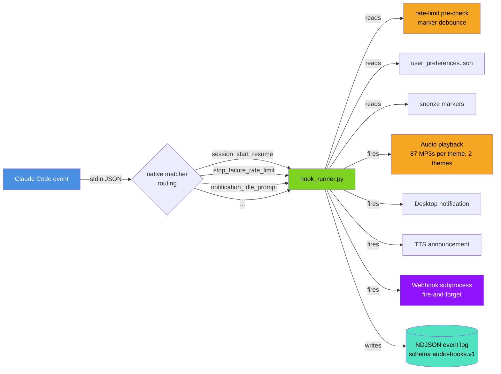
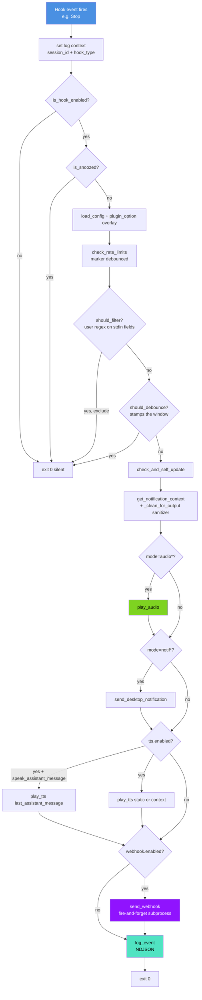
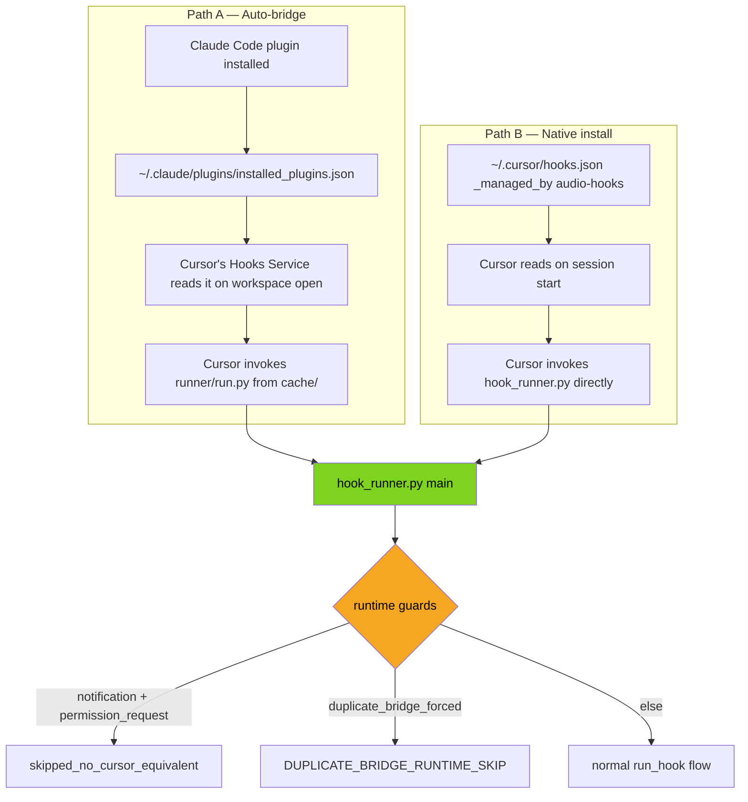
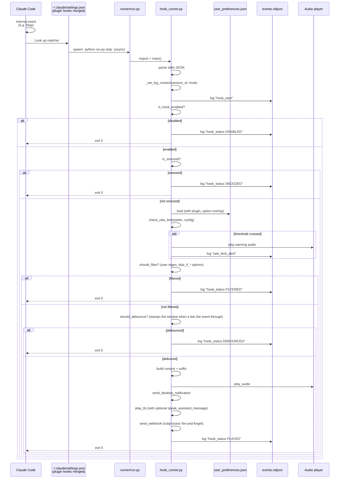
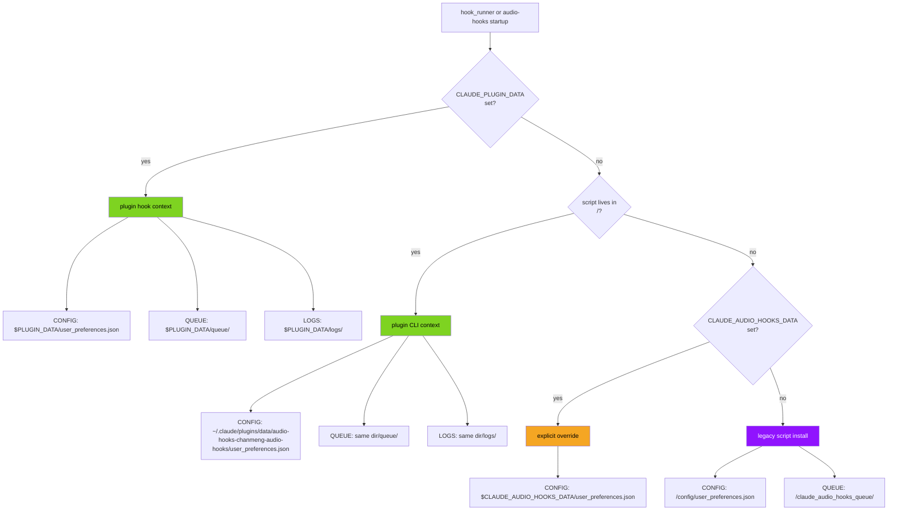
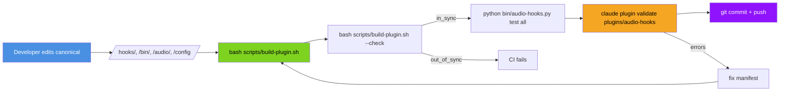

# System Architecture

> **Version:** 6.7.0 | **Last Updated:** 2026-10-03

This document explains the technical architecture of echook. It is the developer-facing deep dive — for operating the project, see [AGENTS.md](../AGENTS.md) (the canonical AI doc; `CLAUDE.md` only imports it) or [README.md](../README.md). For the live machine description of every subcommand and config key, run `audio-hooks manifest`.

> **5.2.x update:** Codex lands as a third editor target. New `hooks/invoker.py` module extracted from `hook_runner.py` so `user_preferences.py` can ask "which IDE invoked us?" without a circular import. The runner consumes a `--invoker codex` CLI flag for native installs and the Codex plugin template at `codex-hooks/plugin-hooks.json` uses `${PLUGIN_ROOT}/runner/run.py`. `_resolve_data_dir()` honors `PLUGIN_DATA` for Codex plugins and otherwise lands Codex-native invocations at `$CODEX_HOME/audio-hooks-data/` when `detect_invoker() == "codex"`. The `run_hook` runtime no-ops the audio-hooks canonical events with no Codex equivalent. Codex hooks are enabled by default; install only emits machine-readable `next_steps` when `[features].hooks = false` disables hooks or `config.toml` cannot be parsed — we never round-trip user-authored TOML.

> **5.1.5 update:** `hooks/user_preferences.py` is now the single source of truth for `user_preferences.json` access. `hook_runner.py` and `bin/audio-hooks.py` consolidated onto it via `get_prefs()` (lazy module-level singleton), eliminating the dual-implementation drift class that produced the 5.1.4 anti-stranding bug. The class owns 6-level path resolution, load with auto-migration (deep-merge missing keys from template; user values win on conflicts), atomic save under cross-platform file lock, and dual-location backups (`<data>/user_preferences.json.bak` for last-good + `~/.claude-audio-hooks-backups/<plugin_id>/<ts>.json` for disaster recovery, kept outside `~/.claude/plugins/data/` so `claude plugin uninstall` cannot wipe them). New `audio-hooks upgrade` and `audio-hooks backup *` subcommands wrap these mechanics for AI operators.

## Design constraints

The project is **AI-operated**, not human-operated:

1. **No interactive CLI prompts, ever.** Every script is unconditionally non-interactive — no `read -p`, no menus, no TTY branching. The human-only menu scripts and `curl | bash` flows were removed in v6.0.0.
2. **No human-readable error logs.** All logs are NDJSON (`audio-hooks.v1` schema) with stable `code` enums and machine-actionable `hint` + `suggested_command` fields.
3. **No GUIs.**
4. **No 2FA / CAPTCHA gates.**
5. **Every config knob is settable in one shot** via `audio-hooks set` or a typed setter.
6. **Every state read returns a single JSON document** in <100ms.
7. **All documentation that Claude Code reads is self-contained, structured, and current.**
8. **Single monolith, one repo, one codebase.** No microservices. The plugin lives inside the same repo as a subdirectory.

## High-level architecture



## Components

### 1. `hooks/hook_runner.py` (canonical, ~3,000 lines)

The Python hook runner is the **single source of truth** for hook event handling. It is invoked in two ways:

| Invocation | Trigger | `CLAUDE_PLUGIN_DATA` set? |
|---|---|---|
| Plugin install | `${CLAUDE_PLUGIN_ROOT}/runner/run.py <event>` from `hooks/hooks.json` | yes |
| Script install | `python ~/.claude/hooks/hook_runner.py <event>` from `~/.claude/settings.json` | no |

The runner accepts both **canonical hook names** (`stop`, `notification`, `session_start`) and **synthetic matcher variants** (`session_start_resume`, `stop_failure_rate_limit`, `notification_idle_prompt`). Synthetic names are mapped to a canonical hook plus a per-variant audio override via `SYNTHETIC_EVENT_MAP`.

### The registration chain, and why it needs tests

Matcher routing happens in the registration template rather than in Python branching, which keeps the runner simple but spreads one logical fact across three files linked only by naming convention:

```
hooks.json  "matcher": "idle_prompt"
  → command arg               notification_idle_prompt
  → SYNTHETIC_EVENT_MAP[…]    ("notification", "notif-idle-prompt.mp3")
  → audio/{default,custom}/   notif-idle-prompt.mp3 / chime-notif-idle-prompt.mp3
```

Nothing validates the chain at runtime. `_resolve_synthetic_event` returns an unknown arg unchanged, `run_hook` receives a hook type nothing recognises, and the event becomes a permanent no-op — no crash, no user-visible log. Two real defects of exactly this shape survived undetected until v6.4: four `session_end_*` variants that were defined but never registered, and four `Notification` matchers that were never registered at all, so those notification types produced no sound whatsoever.

`tests/test_plugin_hooks_contract.py` pins the chain in both directions — every registered arg resolves, every map key is reachable or explicitly allowlisted, every audio override exists in both themes, every notification subtype has its own wording, and `HOOK_CATALOG` agrees with the preferences template. It is the reason a future break is loud. **`plugins/audio-hooks/hooks/hooks.json` is hand-edited and has no repo-root counterpart; `build-plugin.sh` does not sync it.**

### Variant gating (v6.4)

`is_hook_enabled(hook_type, variant)` resolves a five-tier precedence, highest first:

| # | Rule | Rationale |
|--:|---|---|
| 1 | explicit `enabled_hooks[<variant>]` | the user spoke about this exact event |
| 2 | `enabled_hooks[<parent>] is False` | `hooks disable notification` must actually produce silence |
| 3 | `SYNTHETIC_VARIANT_DEFAULTS[<variant>]` | lets a variant ship opt-in under an on-by-default parent |
| 4 | explicit `enabled_hooks[<parent>] is True` | |
| 5 | built-in default set | |

Rule 3 is what stops a newly registered variant of `notification` (on by default) from making noise on every existing install the day it ships — new variants are opt-in, exactly as new events are. Rule 1 outranking rule 2 is the documented escape hatch for keeping one variant of a muted category.

Variant keys are plain booleans in the same flat `enabled_hooks` map as canonical hooks, so `config/user_preferences.schema.json` (`additionalProperties: boolean`) and the migration deep-merge needed no changes, and **no config `_version` bump or user migration was required** to ship the feature.

The variant reaches the gate as an explicit `run_hook(..., variant=…)` parameter rather than via the `_current_synthetic_variant` module global. `bin/audio-hooks.py`'s `_run_one_test` drives `run_hook` directly in a loop, where stale global state from a previous iteration could otherwise decide the next hook's fate.

**Per-invocation flow:**



**Key functions:**

| Function | Purpose |
|---|---|
| `_resolve_synthetic_event(raw_arg)` | Maps synthetic names to canonical + audio override |
| `_resolve_config_file()` | Resolves `user_preferences.json` path: `CLAUDE_PLUGIN_DATA` → plugin context detection → explicit override → legacy script path |
| `_apply_plugin_option_overlay(config)` | Overlays `CLAUDE_PLUGIN_OPTION_*` env vars onto loaded config |
| `is_hook_enabled(hook_type)` | Reads `enabled_hooks.<name>` with v5.0 default-on for `permission_denied` and `task_created` |
| `is_snoozed()` | Reads marker file at `${QUEUE_DIR}/snooze_until` |
| `should_debounce(hook_type)` | Per-hook debounce marker. Runs **after** `should_filter` (v6.7): it stamps the window whenever it lets an event through, so a filtered event must never reach it |
| `should_filter(hook_type, stdin, config)` | User-defined regex filters on stdin fields |
| `check_rate_limits(stdin, config)` | v5.0: inspects `rate_limits` field, fires one-shot warning per `(window, threshold, resets_at)` |
| `get_notification_context(hook, stdin, level)` | Builds the notification text with v5.0 enrichment (last_assistant_message, worktree, agent, etc.) |
| `_format_context_suffix(stdin, level)` | Universal `[session: foo, worktree: bar]` suffix |
| `play_audio(file)` | Platform dispatch: `play_audio_windows` / `_macos` / `_linux` / `_wsl` |
| `send_desktop_notification(title, msg, urgency)` | Platform dispatch: osascript / notify-send / PowerShell NotifyIcon |
| `play_tts(message)` | Platform dispatch: `say` / `espeak` / `spd-say` / SAPI |
| `send_webhook(...)` | v5.0: fire-and-forget via subprocess.Popen so parent exits immediately |
| `log_event(level, action, **fields)` | NDJSON writer with stable schema, log rotation 5MB / 3 files |
| `log_error_event(code, action, ...)` | Adds `error.code` + `error.hint` + `error.suggested_command` |

### 2. `bin/audio-hooks` (canonical CLI)

Three files:

| File | Role |
|---|---|
| `bin/audio-hooks.py` | Python entry point (~4,900 lines), 21 top-level subcommands (`manifest` lists every form) |
| `bin/audio-hooks` | Bash wrapper that probes `python3` / `python` / `py` and exec's the .py file. Skips Microsoft Store python3 stub on Windows. |
| `bin/audio-hooks.cmd` | Windows shim that runs `python audio-hooks.py %*` |

The bash wrapper exists because Git Bash on Windows doesn't reliably handle Python shebangs and the Microsoft Store python3 stub at `WindowsApps\python3.exe` exits 49 silently when invoked. The wrapper probes each candidate with a `-c "import sys"` test and skips broken stubs.

**Read-only invocations (v6.7).** A command that only reports must leave the home and data directories byte-identical. `main()` classifies each invocation with `_is_read_only_invocation()` (backed by the `_READ_ONLY_FORMS` table: `manifest`, `version`, `status`, `diagnose`, `get`, `update`, `hooks list`, `theme [list]`, `snooze status`, bare `webhook` / `tts` / `rate-limits`, `statusline show|segments|subagent show|codex show|codex preview`, `logs tail`, `backup list|show`, and every `--help` path) and sets `_READ_ONLY` for the duration. In that mode `_load_config_raw()` calls `UserPreferences.load(read_only=True)`: template defaults merged under whatever is on disk and the plugin-option overlay applied, all in memory -- no auto-created `user_preferences.json`, no migration save (which also writes a `.bak` and a lock file), no `logs/` or `queue/` directory -- and `_save_config_raw()` refuses. The hook runner and every state-changing command keep the old behaviour: they initialise and migrate on first load. `tests/test_read_only_commands.py` walks every read-only form against a fresh home and a home whose preferences carry an older `_version`, and fails for any manifest subcommand that has not been classified either way.

**`audio-hooks migrate` (v6.7)** is the explicit form of that first-load migration (`UserPreferences.migrate()`): state-changing, no flags, idempotent, and it never creates the preferences file or its directory. It is the remedy `PREFS_SCHEMA_STALE` suggests. Migration also runs `_seed_new_variants`: for a config that enumerated a parent's variants (parent explicitly `true`, every older sibling an explicit boolean — what `hooks enable-only <variant>` writes), a variant introduced after the stored `_version` is written explicitly `false` so it cannot become audible unasked; a config that only enables the parent inherits as before. The release that introduced each variant is `UserPreferences.VARIANT_INTRODUCED`, which `tests/test_variant_migration.py` keeps equal to `SYNTHETIC_EVENT_MAP`.

**Subcommand dispatch table** lives at the bottom of `audio-hooks.py` (the `DISPATCH` dict). Adding a new subcommand: write `cmd_<name>(args) -> int`, add to `DISPATCH`, add an entry to `_build_manifest()`'s `subcommands` list.

**Plugin context detection** (`_is_running_from_plugin()`): the binary lives at `<plugin_root>/bin/audio-hooks.py` when invoked from a plugin install. We detect this by checking for `<plugin_root>/.claude-plugin/plugin.json`. When detected, `_config_path()` resolves to `~/.claude/plugins/data/audio-hooks-chanmeng-audio-hooks/user_preferences.json` (the canonical plugin data dir per Claude Code's docs) and auto-initialises from `default_preferences.json` on first read.

### 3. `plugins/audio-hooks/` (Claude Code plugin)

Self-contained plugin layout, populated by `bash scripts/build-plugin.sh` from the canonical sources.

```
plugins/audio-hooks/
├── .claude-plugin/
│   └── plugin.json              # name, displayName, version, userConfig (webhook_url is sensitive)
├── hooks/
│   ├── hooks.json               # matcher-scoped hook registration (auto-discovered)
│   └── hook_runner.py           # copy of /hooks/hook_runner.py
├── runner/
│   └── run.py                   # imports bundled hook_runner.py and dispatches
├── skills/
│   └── audio-hooks/
│       └── SKILL.md             # natural-language activation
├── evals/                       # `claude plugin eval` cases for the skill (text-only; results/ is git-ignored)
├── README.md                    # hand-edited disclosure: what it runs, sends, writes (plugin directory requirement)
├── bin/
│   ├── audio-hooks              # bash wrapper
│   ├── audio-hooks.py           # Python entry
│   └── audio-hooks.cmd          # Windows shim
├── audio/
│   ├── default/                 # 26 voice files
│   └── custom/                  # 26 chime files
└── config/
    └── default_preferences.json # template (auto-copied to plugin data dir)
```

**`hooks/hooks.json`** registers per-matcher handlers using synthetic event names:

```jsonc
{
  "hooks": {
    "Notification": [
      { "matcher": "permission_prompt",
        "hooks": [{ "type": "command",
                    "command": "python \"${CLAUDE_PLUGIN_ROOT}/runner/run.py\" notification_permission_prompt",
                    "async": true, "timeout": 10 }] },
      { "matcher": "idle_prompt",      "hooks": [...] },
      { "matcher": "auth_success",     "hooks": [...] },
      { "matcher": "elicitation_dialog","hooks": [...] }
    ],
    "SessionStart": [
      { "matcher": "startup", "hooks": [...session_start_startup] },
      { "matcher": "resume",  "hooks": [...session_start_resume] },
      { "matcher": "clear",   "hooks": [...session_start_clear] },
      { "matcher": "compact", "hooks": [...session_start_compact] }
    ],
    "StopFailure": [
      { "matcher": "rate_limit",            "hooks": [...stop_failure_rate_limit] },
      { "matcher": "authentication_failed", "hooks": [...stop_failure_authentication_failed] },
      { "matcher": "billing_error|invalid_request|server_error|max_output_tokens|unknown",
        "hooks": [...stop_failure_other] }
    ]
    // ... and so on for all 28 Claude Code events
  }
}
```

Native matcher routing happens at the `settings.json` layer (Claude Code's matcher engine), not inside Python branching. Faster, configurable per-matcher, and per-handler `async: true` means a slow rate-limit-failure path doesn't block the auth-failure path.

**Auto-discovery**: don't put `"hooks": "./hooks/hooks.json"` in `plugin.json` — Claude Code auto-discovers `hooks/hooks.json` from the standard location, and declaring it twice causes "Duplicate hooks file detected" load errors.

**`runner/run.py`** is a thin wrapper that walks up from its own directory looking for `hooks/hook_runner.py` (which is bundled inside the plugin), inserts that path into `sys.path`, and calls `hook_runner.main()`.

**`skills/audio-hooks/SKILL.md`** is the natural-language activation surface. YAML frontmatter declares trigger phrases like *"snooze audio"*, *"configure audio hooks"*, *"why is there no sound"*. When Claude detects an intent matching one of these, it loads the SKILL body which is a structured prose-and-table guide telling Claude exactly which `audio-hooks` subcommand to run for any user request. The golden rule baked into the SKILL: **always run `audio-hooks manifest` first** if you're unsure of the project's current surface area.

### 4. `bin/audio-hooks-statusline` (Claude Code status line)

Two-line bottom bar registered in `~/.claude/settings.json` via `audio-hooks statusline install`. Reads stdin JSON Claude Code provides (model name, `effort.level`, Claude Code `version`, session_id, `cwd` / `workspace.current_dir`, workspace.git_worktree, `rate_limits.{five_hour,seven_day}`, `context_window`, `cost`) and emits two lines of plain text with ANSI colors:

```text
[Opus 4.8 (1M context)] | 🧠 high | ⚡ CC v2.1.193 | 📁 D:\…\claude-code-audio-hooks | 🔊 echook v6.4.1 | 6/37 Sounds | Theme: Voice
[MUTED 23m]  🌿 feat/audio-v5  ████░░░░ API Quota: 78% · resets 2pm  ███████░ Weekly: 82% · resets Jul 4 9pm  █████░░░ Context: 65% (130K/200K) ⚠️ /compact  💲 $0.42 +156/-23
```

The API Quota bar uses thresholds GREEN <70%, YELLOW 70-89%, RED ≥90%. The Context bar uses agent-safety thresholds: GREEN <50% (safe), YELLOW 50-80% (should `/compact`), RED >80% (agent "dumb zone"). Actionable hints (`⚠️ /compact` or `🛑 /compact`) appear in yellow/red zones.

**Context segment numerator (v5.1.3+).** When Claude Code's stdin JSON includes both `context_window.used_percentage` and `context_window.context_window_size`, the segment appends absolute counts via `_fmt_tokens()`, e.g. `Context: 83% (166K/200K)`. The numerator is **derived** as `int(round(used_percentage × context_window_size / 100))` — we deliberately do NOT use the `total_input_tokens` field from the JSON because it counts only literal input tokens (excluding `cache_read_input_tokens` / `cache_creation_input_tokens`), which understates real context usage by ~30× in cache-heavy sessions like Claude Code itself. Deriving from the percentage guarantees the displayed math is internally self-consistent. When `context_window_size` is missing, malformed, or non-positive, the segment falls back silently to the pre-5.1.3 form `Context: 83%`. Regression-guarded by `tests/test_statusline.py::TestContextSegment`.

**Diagnostic dump (v5.1.3+).** Setting `CLAUDE_HOOKS_DEBUG=1` (or `true`/`yes`, case-insensitive — matches `hook_runner.DEBUG`) causes the script to atomically write the most recent stdin JSON to `${state_dir}/statusline.last_input.json` via per-PID tempfile + `os.replace`. Used to diagnose what Claude Code is actually piping (e.g. confirming whether `context_window_size` updated after a `/model` change). Privacy note: the dump may include workspace paths, transcript path, and the last assistant message — disable when not actively diagnosing.

Users can customise which segments appear via `statusline_settings.visible_segments` (whitelist) or `statusline_settings.hidden_segments` (blacklist, applied when the whitelist is empty). **33 segments available** (29 in v6.3.0, 33 since v6.7.0) — Line 1: `model`, `session_name`, `agent`, `remote`, `effort`, `fast_mode`, `thinking`, `vim`, `output_style`, `cc_version`, `cwd`, `repo`, `version`, `sounds`, `webhook`, `theme`; Line 2: `snooze`, `branch`, `git_dirty`, `worktree`, `pr`, `added_dirs`, `api_quota`, `weekly_quota`, `spend_limit`, `context`, `tokens`, `prompt_cache`, `exceeds_200k`, `cost`, `duration`, `api_time`, `burn_rate`. Two of them — `remote` and `prompt_cache` — are **opt-in** (their catalog entry carries `"default": false`): they appear only when named in `statusline_settings.extra_segments` (or in a non-empty `visible_segments` whitelist), so upgrading changes no existing status line; `hidden_segments` still wins. `spend_limit` and `fast_mode` are in the default set but, like the rest, draw only when Claude Code sends the field. [STATUS_LINE.md](STATUS_LINE.md) has the renderings and minimum Claude Code versions. The full catalog (each segment's source field + conditional flag) lives in `STATUSLINE_SEGMENTS` (`bin/audio-hooks.py`), exposed via `audio-hooks statusline segments`. `effort`, `cc_version`, `weekly_quota`, and `cost` mirror the Claude Code startup banner so that information stays visible after the banner scrolls off; most richer segments self-omit when Claude Code doesn't supply the underlying field (e.g. `weekly_quota`/`api_quota` only for Claude.ai subscribers, `pr` only inside a PR, `vim` only in vim mode, `output_style` only when not `default`). `git_dirty` is the one segment that shells out — `git status --porcelain`, cached per-cwd for `CACHE_TTL_SEC` via `_git_dirty()` (non-repos cache `-1` so they don't re-shell); everything else comes from the stdin JSON. The subscription **plan name** is *not* exposed to status line scripts, so it is intentionally not rendered. The `cwd` segment renders the current working directory as an abbreviated path (home → `~`, long paths shortened to `<root>…<last folder>` via `_abbrev_path()`). Empty `visible_segments` (default) shows every default-set segment; `hidden_segments` lets a user drop a few. Example: `audio-hooks set statusline_settings.visible_segments '["context","api_quota"]'` shows only the two progress bars.

**Codex status line curation (v6.3.0).** Codex's status line is *not* command-backed — it renders only fixed lists of built-in item IDs under `[tui].status_line` and `[tui].terminal_title` in `config.toml` (command rendering is open feature request openai/codex#17827). echook cannot render a custom Codex status line, only **curate** those fixed lists so they stop truncating with an ellipsis. `audio-hooks statusline codex {show,preview,apply}` (presets `minimal`/`balanced`/`full`, `--items`, `--target status_line|terminal_title|both`) does a **surgical** text edit via `_codex_apply_tui_array(text, key, items)`: it locates the `[tui]` table and replaces only the targeted array (matching the exact key so `status_line` is not confused with `status_line_use_colors`; handling multi-line arrays by bracket balance; inserting the key or a `[tui]` header when absent), preserving every other table, comment, and the file's formatting. `apply` backs up `config.toml` first (`_backup_file()`) and, when `tomllib` is available (3.11+), validates the result parses and round-trips before writing. Regression-guarded by `tests/test_codex_statusline.py`.

**Width-aware reflow (v6.1.0+).** Each line is packed into as many physical rows as the terminal width needs, wrapping only at segment boundaries so no segment is ever split or truncated by Claude Code (the `Webho…` overflow). Width is resolved by `_terminal_width()`: explicit `statusline_settings.max_width` override → the `COLUMNS` env var Claude Code exports before each run (v2.1.153+; read via `shutil.get_terminal_size`, which can't probe a piped stdout directly) → fallback 80, minus `WIDTH_SAFETY_MARGIN` (8 columns since v6.3.1; it was 4 before). The margin matters because `COLUMNS` is the *full* terminal width but the *usable* width is smaller — the registered `padding` indents the line and terminals reserve the rightmost cell — so packing against the raw `COLUMNS` overfills the last row by a few columns and Claude Code truncates it. `statusline install` registers `padding: 0` (was `1`) to maximise usable width; the margin covers any residual padding plus the edge. Users on a narrower-than-reported terminal can pin the exact width via `max_width`. Segment widths are measured by `_vwidth()`, which strips ANSI escapes (zero width), counts emoji/CJK as two cells and box-drawing bar glyphs (█/░) as one, and ignores variation selectors / combining marks — then `_pack_lines()` greedily distributes segments. Regression-guarded by `tests/test_statusline.py::TestReflow` / `TestVwidth` / `TestPackLines`.

`refreshInterval: 60` is set in the registration so snooze countdowns, rate-limit bars, and context usage bars update during idle periods. The script caches `audio-hooks status` for 5 seconds keyed on `session_id` to keep render time <100ms.

### 5. `scripts/`

echook is **AI-agent-first**: every script is non-interactive and machine-callable.
There are no human-only menus and no `curl | bash` flows — an agent operates the whole
project through the `audio-hooks` CLI. The script install below is the engine behind
`audio-hooks install --scripts` (cloned-repo / non-plugin path; since v6.6.0 `install` has no default mode and refuses `--scripts` while the plugin is installed unless `--force`); on Claude Code the canonical path
is the plugin marketplace.

| Script | Purpose | AI-callable? |
|---|---|---|
| `install-complete.sh` | Script install engine (registers `hook_runner.py`) | yes — always non-interactive |
| `install-windows.ps1` | PowerShell install engine for Windows | yes — always non-interactive |
| `uninstall.sh` | Thin wrapper for a source checkout: runs `audio-hooks uninstall --scripts` (the removal itself lives in the CLI since v6.6.0 and works from the plugin layout, which ships no `scripts/`) and implements `--purge` for that checkout's config/audio | yes — always non-interactive, `--purge` for full removal |
| `build-plugin.sh` | Sync canonical → plugin layout | yes (NDJSON output, `--check` flag for CI) |
| `bump-version.sh` | Atomic version bump across canonical files | yes (JSON output) |
| `generate-audio.py` | ElevenLabs audio generator | yes (NDJSON output, `--force` / `--only` / `--dry-run`) |

All configure / test / snooze / diagnose operations are CLI subcommands
(`audio-hooks set`, `audio-hooks test all`, `audio-hooks snooze`, `audio-hooks diagnose`)
— the former `configure.sh` / `test-audio.sh` / `snooze.sh` / `diagnose.py` and the
`quick-*` lite-tier scripts were removed in v6.0.0.

### 6. Cursor IDE integration (5.1.4+, hardened in 5.1.6)

Cursor IDE 3.2.16+ is a first-class invoker for this project. The integration has two distinct paths, each with different runtime invariants:



**Path A: auto-bridge (most users).** Cursor 3.2.16+ scans `~/.claude/plugins/installed_plugins.json` on every workspace open and registers the plugin's `hooks/hooks.json` events as Cursor's own session hooks. Cursor invokes `~/.claude/plugins/cache/chanmeng-audio-hooks/audio-hooks/<ver>/runner/run.py` on its own session events, but **does not inject `CLAUDE_PLUGIN_DATA`** and **does not pass through Claude Code's stdin schema** — Cursor uses its own (camelCase event names, fields like `cursor_version`, `conversation_id`, `final_status`, `duration_ms`, `is_background_agent`, `workspace_roots`, `model`, `error_message`, plus compat fields `session_id`, `hook_event_name`, `transcript_path`).

**Path B: native install (Cursor without Claude Code).** `audio-hooks install --cursor` writes `~/.cursor/hooks.json` from the canonical template at `cursor-hooks/hooks.json`, substituting `{{PYTHON}}` and `{{HOOK_RUNNER}}` with absolute paths. The substituted JSON is the source of truth: every event entry is tagged `"_managed_by": "audio-hooks"` so `uninstall --cursor` can scope its cleanup. Backslashes in Windows paths are JSON-escaped before substitution (5.1.6 fix; pre-5.1.6 substituted raw, producing invalid JSON).

**Bridge mapping (Cursor's responsibility, per [cursor.com/docs/reference/third-party-hooks](https://cursor.com/docs/reference/third-party-hooks)):**

| Claude Code | Cursor | Bridge |
|---|---|---|
| PreToolUse | preToolUse | yes |
| PostToolUse | postToolUse | yes |
| UserPromptSubmit | beforeSubmitPrompt | yes |
| Stop | stop | yes |
| SubagentStop | subagentStop | yes |
| SessionStart | sessionStart | yes |
| SessionEnd | sessionEnd | yes |
| PreCompact | preCompact | yes |
| Notification | — | NO Cursor equivalent |
| PermissionRequest | — | NO Cursor equivalent |

`subagentStart`, `postToolUseFailure`, and `afterFileEdit` are **Cursor-native events** — they exist in Cursor but have no Claude Code equivalent and so cannot be auto-bridged. The Path B template registers them; the Path A bridge cannot.

**Tool-name mapping (Cursor side):** `Bash`→`Shell`, `Edit`→`Write`. `Glob` / `WebFetch` / `WebSearch` matchers do not fire under Cursor (Cursor lacks these tool types).

**Key components:**

| Function | Location | Purpose |
|---|---|---|
| `detect_invoker()` | `hooks/hook_runner.py` | Returns `"claude-code"` / `"cursor"` / `"unknown"` from env vars (`CURSOR_VERSION`, `CLAUDE_PLUGIN_DATA`, `CLAUDE_PLUGIN_ROOT`). Cursor wins when both are set. Cached per-process via `_invoker_cache`. |
| `UserPreferences._resolve_data_dir()` | `hooks/user_preferences.py` | 6-level fallback chain: `CLAUDE_PLUGIN_DATA` → `CLAUDE_AUDIO_HOOKS_DATA` → plugin-cache detection → `~/.claude/plugins/data/<id>/` (if user_preferences.json exists) → `~/.cursor/audio-hooks-data/` (if user_preferences.json exists) → legacy temp dir. The Cursor branch is the 5.1.4 anti-stranding fix. |
| `session_start` env-emit | `hooks/hook_runner.py:main()` | When invoker is Cursor, writes `{"env": {"CLAUDE_PLUGIN_DATA": "<path>"}}` to stdout. Per Cursor's docs, `sessionStart` env outputs propagate to every subsequent hook in the session — so all later hooks see the right path without depending on the runtime fallback. Silent when invoker is not Cursor. |
| `_read_install_marker()` | `hooks/hook_runner.py` | Reads `${data_dir}/install_marker.json` once per process (cached as `{}` on miss). Used by the runtime double-fire guard. |
| `run_hook()` runtime guards | `hooks/hook_runner.py` | (1) If invoker is Cursor and hook is `notification`/`permission_request`: log `skipped_no_cursor_equivalent` and exit 0. (2) If invoker is Cursor and `duplicate_bridge_forced: true`: log `duplicate_bridge_runtime_skip` (`DUPLICATE_BRIDGE_RUNTIME_SKIP`) and exit 0. Both guards run before any audio/notification/webhook firing. |
| `_install_cursor` / `_uninstall_cursor` | `bin/audio-hooks.py` | Path B installer. Detects DUPLICATE_BRIDGE via `_detect_install_mode()` (reads `~/.claude/plugins/installed_plugins.json`). `--force` overrides the abort and stamps `duplicate_bridge_forced: true` in the install marker. Uninstall removes only `_managed_by: audio-hooks` entries; `--purge` deletes `~/.cursor/audio-hooks-data/` too. |
| `_detect_editor_targets()` | `bin/audio-hooks.py` | Reports per-editor state: `active` / `bridged-via-claude-code` / `native` / `double-registered` / `inactive`. Surfaced in `status`, `diagnose`, and `manifest` output. |

**Webhook payload extensions:** when invoker is Cursor, the raw payload includes `invoker: "cursor"` plus a `cursor: {...}` sub-object surfacing the Cursor-specific stdin fields. `user_email` is **redacted by default** (`webhook_settings.include_user_email` opt-in flag; off because the webhook URL may be third-party).

**NDJSON event log:** every event includes an `invoker` field for cross-IDE filtering. `audio-hooks logs tail --invoker cursor` is the canonical filter (also reachable as a `jq` query against `events.ndjson`).

**Test contract:** `tests/test_cursor_bridge.py` (32 cases as of 5.1.6) pins all of the above as invariants. Adding a new bridge-relevant code path? Add a regression test there.

## Hook event lifecycle (full detail)



## Path resolution



The plugin data dir is at `~/.claude/plugins/data/{id}/` where `{id}` is the plugin name with non-alnum chars replaced by `-`. For `audio-hooks@chanmeng-audio-hooks` the id is `audio-hooks-chanmeng-audio-hooks`.

## NDJSON event log

Schema: `audio-hooks.v1`. One JSON object per line. Event types are stable.

| `action` | `level` | When |
|---|---|---|
| `hook_start` | `debug` | Every hook invocation, with `synthetic_variant` if matcher-routed |
| `hook_status` | `info` | Final status: `PLAYED`, `DISABLED`, `SNOOZED`, `DEBOUNCED`, `FILTERED`, `NO_AUDIO_CONFIG`, `FILE_NOT_FOUND`, `PLAY_FAILED` |
| `rate_limit_alert` | `warn` | Rate-limit threshold crossed; includes `window`, `threshold`, `used_percentage`, `resets_at` |
| `tts_spoken` | `info` | TTS dispatched |
| `webhook_dispatched` | `info` | Webhook subprocess spawned |
| `audio_override_resolved` | `debug` | Synthetic matcher variant resolved an audio override |
| `play_audio` | `info` | Audio successfully dispatched to platform player |
| `legacy_error` | `error` | Caught from `log_error()` legacy wrapper |
| `lookup_audio` | `error` | `AUDIO_FILE_MISSING` |
| `webhook_dispatch` | `error` | `WEBHOOK_TIMEOUT` or `WEBHOOK_HTTP_ERROR` |

Error events carry an `error` object with `code` (stable enum), `message`, `hint`, and optionally `suggested_command`.

## Stable error code enum

Defined in `hook_runner.py`'s `ErrorCode` class. Add new codes here, never rename existing ones.

```python
class ErrorCode:
    AUDIO_FILE_MISSING = "AUDIO_FILE_MISSING"
    AUDIO_PLAYER_NOT_FOUND = "AUDIO_PLAYER_NOT_FOUND"
    AUDIO_PLAY_FAILED = "AUDIO_PLAY_FAILED"
    INVALID_CONFIG = "INVALID_CONFIG"
    CONFIG_READ_ERROR = "CONFIG_READ_ERROR"
    WEBHOOK_HTTP_ERROR = "WEBHOOK_HTTP_ERROR"
    WEBHOOK_TIMEOUT = "WEBHOOK_TIMEOUT"
    NOTIFICATION_FAILED = "NOTIFICATION_FAILED"
    TTS_FAILED = "TTS_FAILED"
    SETTINGS_DISABLE_ALL_HOOKS = "SETTINGS_DISABLE_ALL_HOOKS"
    PROJECT_DIR_NOT_FOUND = "PROJECT_DIR_NOT_FOUND"
    SELF_UPDATE_FAILED = "SELF_UPDATE_FAILED"
    UNKNOWN_HOOK_TYPE = "UNKNOWN_HOOK_TYPE"
    INTERNAL_ERROR = "INTERNAL_ERROR"
    DUPLICATE_BRIDGE_RUNTIME_SKIP = "DUPLICATE_BRIDGE_RUNTIME_SKIP"
```

(15 codes here; the 22 CLI-only ones below bring `manifest.error_codes` to 37.)

The CLI emits more codes than that: `INVALID_USAGE`, `DUAL_INSTALL_DETECTED`, `DUPLICATE_BRIDGE`, `UNINSTALL_INCOMPLETE`, the `UPGRADE_*` family and the `diagnose` findings (`NO_COMPLETION_SIGNAL`, `WINDOWS_NO_GIT_BASH`, ...) exist only in `bin/audio-hooks.py`. Since v6.7 they are catalogued in its `CLI_ERROR_CODES` table (code, one-line meaning, suggested remedy, and whether it appears in a command error or in `diagnose`), and `_build_manifest()` merges that table with `ErrorCode`, so `audio-hooks manifest` → `error_codes` lists every code either side can emit. `tests/test_cli_error_codes.py` parses the CLI source and fails when an `emit_error("CODE", ...)` call or a `{"code": "CODE"}` literal names a code in neither table, or when the table lists one that is never emitted.

`_ERROR_HINTS` (a dict in `hook_runner.py`) maps each code to a `hint` (one sentence) and `suggested_command` (a literal `audio-hooks ...` command). When `log_error_event(code, action, message)` is called, the resulting NDJSON event has the full error object populated automatically.

## Backwards compatibility

| Pre-v5.0 surface | v5.0.1 status |
|---|---|
| `~/.claude/settings.json` legacy hook entries (`Notification`, `Stop`, `SubagentStop`, `PermissionRequest`) | Still work — canonical hook names resolve in `hook_runner.main()` |
| Free-text `debug.log`, `errors.log`, `hook_triggers.log` | Replaced by `events.ndjson`. Legacy `log_debug`/`log_error`/`log_trigger` are now thin NDJSON wrappers. |
| `<project>/config/user_preferences.json` (script install) | Still the resolution target for script installs |
| `bash scripts/install-complete.sh` | Still works; now always non-interactive (no human menu) |
| `scripts/snooze.sh` / `configure.sh` / `test-audio.sh` / `diagnose.py` / `quick-*` | Removed in v6.0.0 — use `audio-hooks snooze` / `set` / `test all` / `diagnose` |
| Pre-v5 `user_preferences.json` schema | Forward-compatible — new keys are optional with sensible defaults |

## Build pipeline



## Adding a new hook event (when Claude Code adds one)

The registration chain is held together by naming convention alone, and an
unresolvable arg becomes a **permanent silent no-op** — no crash, no log line
anyone reads. Work through every step; the contract tests in step 12 are what
make a break loud.

**Runtime — `hooks/hook_runner.py`**

1. `DEFAULT_AUDIO_FILES` — canonical name → `<file>.mp3`.
2. `CUSTOM_AUDIO_FILES` — canonical name → `chime-<file>.mp3`. Two separate
   tables; the custom path is *derived* by prefix elsewhere, so both need the
   entry.
3. `get_notification_context()` — a branch for the notification text. Omitting
   it does not crash: the name degrades to `hook_type.replace("_"," ").title()`,
   which is why a missing branch is easy to ship unnoticed. For a `Notification`
   subtype add to `NOTIFICATION_TYPE_LABELS` instead — that path is data, and
   the contract test checks it in **both** directions.
4. `_CURSOR_UNSUPPORTED` / `_CODEX_UNSUPPORTED` — add the name if that editor
   has no equivalent, so the runner no-ops with a `skipped_no_*_equivalent`
   debug event rather than pretending to fire.
5. If matcher-scoped: `SYNTHETIC_EVENT_MAP`. A variant of an **on-by-default**
   parent also needs `SYNTHETIC_VARIANT_DEFAULTS[<variant>] = False`, or merely
   registering the matcher starts making noise on every existing install.

**CLI — `bin/audio-hooks.py`**

6. `HOOK_CATALOG` — drives `total_hook_count`, `test all`, `diagnose`'s audio
   checks, and `hooks enable/disable` validation.
7. `_MOCK_STDIN` (optional) — synthetic stdin for `audio-hooks test <event>`.
   Without it the test falls back to a bare `{hook_event_name, session_id}`.

**Config — `config/`**

8. `default_preferences.json` → `enabled_hooks`. Must match
   `HOOK_CATALOG[].default` exactly or the contract test fails. **Canonical
   events only** — variant keys are forbidden here and are derived instead.
9. `default_preferences.json` → `tts_settings.messages` — the spoken string.
10. `_defaults_baseline.json` — the pinned snapshot. A *new* key is fine; a
    *flipped* existing key fails `test_defaults_stability.py`.
11. `audio_manifest.json` — two entries (default + custom theme), then
    `ELEVENLABS_API_KEY=... python scripts/generate-audio.py --only <files>`.
    **Matcher variants need this too.** Since v6.5.0 every event *and* every
    variant owns a distinct sound: a variant that reuses its parent's file is
    audibly indistinguishable from it, which makes its independent toggle
    pointless. `TestAudioUniqueness` fails if any two slots share a file, if a
    variant has no override, or if two manifest prompts are identical (same
    prompt, same audio, different filename).

**Templates — one per editor**

12. `plugins/audio-hooks/hooks/hooks.json` (Claude Code). **Hand-edited:
    `build-plugin.sh` does not sync it and there is no repo-root copy**, so it
    looks generated but is not.
13. `cursor-hooks/hooks.json` — only if Cursor has the event.
14. `codex-hooks/hooks.json` — only if Codex has it; every command **must**
    carry `--invoker codex`.
15. `codex-hooks/plugin-hooks.json` — the Codex *plugin* path, separate from
    the native one, using `${PLUGIN_ROOT}`.

**Legacy script-install path — `scripts/`**

16. `install-complete.sh` → `all_hook_types` (+ `hooks_with_matcher` /
    `smart_matchers` if applicable).
17. `LEGACY_HOOK_EVENTS` in `bin/audio-hooks.py` (the native removal behind
    `audio-hooks uninstall`; `scripts/uninstall.sh` is now a wrapper with no
    event list or matching rule of its own, which
    `test_legacy_scripts_contract.py` asserts). Missing it here is the worst failure mode: the
    registration outlives the uninstall, pointing at a deleted script.

**Finish**

18. `bash scripts/build-plugin.sh` — syncs everything except step 12.
19. `python bin/audio-hooks.py test <new_hook>`.
20. `python -m unittest discover tests` — `test_plugin_hooks_contract.py` and
    `test_legacy_scripts_contract.py` fail loudly if the registration, the
    synthetic map, the audio files, the catalogue and the scripts have drifted.
21. Docs: the counts are **not** touched by `bump-version.sh` and are all
    manual — `README.md`, `AGENTS.md`, `llms.txt`,
    `docs/CLI_REFERENCE.md`, `docs/INSTALLATION_GUIDE.md`, `SKILL.md`, both
    `plugin.json`s and `marketplace.json`.
22. Bump the version and write the CHANGELOG entry.

**Verify the event's real semantics before relying on its name.** v6.3.4 was an emergency rollback because `WorktreeCreate` turned out to be a *provider* hook that hijacked worktree creation. Register a capture shim against the event, exercise it for real, and record what you observed in `docs/EVENT_BEHAVIOR_NOTES.md` and the CHANGELOG — v6.4.0's `### Note` is the worked example, including how a catch-all matcher distinguishes "this type never fires" from "this matcher string is unrecognised".

## Adding a new audio file

1. Add an entry to `config/audio_manifest.json`: `filename`, `theme`, `type` (`voice` or `sound_effect`), `text` prompt.
2. `ELEVENLABS_API_KEY=... python scripts/generate-audio.py --only <new_file>`.
3. `bash scripts/build-plugin.sh`.
4. Commit the new MP3 + manifest entry.

## Testing locally

```bash
# From a fresh terminal — verify the binary works
python bin/audio-hooks.py manifest
python bin/audio-hooks.py status
python bin/audio-hooks.py test all
python bin/audio-hooks.py diagnose

# Verify the plugin layout
bash scripts/build-plugin.sh --check
claude plugin validate plugins/audio-hooks

# Run the unit-test suite (stdlib-only, no extra deps)
python -m unittest discover tests

# Verify a specific hook with mock stdin
echo '{"session_id":"t","hook_event_name":"Stop","last_assistant_message":"test"}' | \
  python hooks/hook_runner.py stop

# Test rate-limit alert
echo '{"session_id":"t","rate_limits":{"five_hour":{"used_percentage":85,"resets_at":9999999999}}}' | \
  python hooks/hook_runner.py stop

# Test the status line (Sonnet-after-/model-switch case)
echo '{"session_id":"t","model":{"display_name":"Sonnet"},"context_window":{"used_percentage":83,"context_window_size":200000}}' | \
  python bin/audio-hooks-statusline.py
```

The `tests/` directory is wired into `.github/workflows/smoke.yml` and runs on every push/PR across the 9-job matrix (Ubuntu / Windows / macOS × Python 3.9 / 3.12 / 3.13). Adding new tests there is the canonical way to pin behavioural contracts.

## See also

- [AGENTS.md](../AGENTS.md) — canonical AI-facing operating guide (`CLAUDE.md` is a one-line import of it, because Claude Code ignores `AGENTS.md` when a `CLAUDE.md` exists)
- [README.md](../README.md) — public-facing project introduction
- [CHANGELOG.md](../CHANGELOG.md) — version history including the v5.0/v5.0.1 detail
- [EVENT_BEHAVIOR_NOTES.md](EVENT_BEHAVIOR_NOTES.md) — observed vs documented behaviour of Claude Code's hook events
- `audio-hooks manifest` — live machine description of every subcommand and config key
